# `Pypi-server` Release Workflow Reference

The official `pypi-server` releases are handled using
[GitHub Actions workflows](../../../.github/workflows/).

## General release process

```mermaid
flowchart LR
    rc["release-candidate ⭐️"]
    rn["release-notes 📝"]
    rm["confirmed-tag ✅"]
    ci["code-checks 🧪"]
    pk["build-and-pack 📦"]
    py["pypi-index 🗃️"]
    do["docker-hub 🐳"]
    gh["gh-container-registry 🚀"]
    gr["github-release 📣"]

    subgraph "Preparation 🌱"
    rc-->rn-->rm
    end
    subgraph "Integration 🪴"
    rm-->ci-->pk
    end
    subgraph "Deploy 🌳"
    pk--> py & do & gh & gr
    end
```

## Process walkthrough

> 🗺️ ***This description approximates the real GitHub workflows and steps.***  
> 👀 *For a more detailed view, do check out the linked resources as you read.*

### Preparation 🌱

> 🛠️ *These step are applicable only for maintainers.*

#### Release candidate ⭐️

A new release candidate can be initiated ***manually** or **on a monthly schedule***.

This is done via the [`rc.yml`](../../../.github/workflows/rc.yml) GH
Workflow's `workflow_dispatch` or `schedule` trigger.

The workflow automatically prepares a list of changes for the `CHANGES.rst` and
creates a new Pull Request *(rc PR)* named
`chore(auto-release-candidate-YYY-MM-DD)` including these draft change notes.

#### Release notes 📝

In the created rc PR, open the `CHANGES.rst` and:

1. ***adjust the suggested changelog items***
2. ***choose & set the next released version***
3. ***set the right release date***

Commit the changes and push them to the head branch of the rc PR.

#### Confirmed tag ✅

1. Once everything is looking good, ***approve and merge*** the rc PR.

    It will create the new *commit* with the updated `CHANGES.rst`
    on the default branch.

2. Next, to create a release tag, ***manually run*** the
    [`rt.yml`](../../../.github/workflows/rt.yml) GH Workflow.

    First, it executes all the [`bumpver`](../../../bin/README.md) procedures.

    Next, it commits and pushes the new **version tag** to the default branch.

### Integration 🪴

#### Code checks 🧪

Once any *commmit* or *tag* is pushed to the default branch,
[`ci.yml`](../../../.github/workflows/ci.yml) GH Workflow automatically
executes diverse code checks: e.g. *linting*, *formatting*, *tests*.

#### Build and pack 📦

If all the checks are successful, [`ci.yml`](../../../.github/workflows/ci.yml)
builds all the code artifacts: e.g. *wheels*, *docker images*.

### Deploy 🌳

#### Publish to PyPi 🗃️

> 🏷️ This happens only on new *version tags*.

Once everythig is built, [`ci.yml`](../../../.github/workflows/ci.yml) uploads
the wheels to the [`pypiserver` PyPi project](https://pypi.org/project/pypiserver/).

#### Publish to Docker Hub 🐳

> 🏷️ Docker image *tags* are determined on the fly.

If all is successful so far, [`ci.yml`](../../../.github/workflows/ci.yml) tags
the built docker images and pushes them to the
[`pypiserver` Docker Hub repository](https://hub.docker.com/r/pypiserver/pypiserver).

#### Publish to GitHub Container Registry 🚀

> 🏷️ Docker image *tags* are determined on the fly.

For all `stable` (i.e. `latest`, tag, release ...) tags derived by
[`ci.yml`](../../../.github/workflows/ci.yml) tags,
the built docker images are *also* pushed to
[`pypiserver` GitHub Container Registry](https://github.com/orgs/pypiserver/packages?repo_name=pypiserver).

#### Publish a GitHub Release draft 📣

> 🛠️ *This step is applicable only for maintainers.*  
> 🏷️ This happens only on new *version tags*.  

To make the release noticeable, [`ci.yml`](../../../.github/workflows/ci.yml)
also creates a *draft*
[GitHub Release entry in the `pypiserver` repository](https://github.com/pypiserver/pypiserver/releases).

> 📝 Since it is a *draft*, the entry should be *manually* adjusted further.
